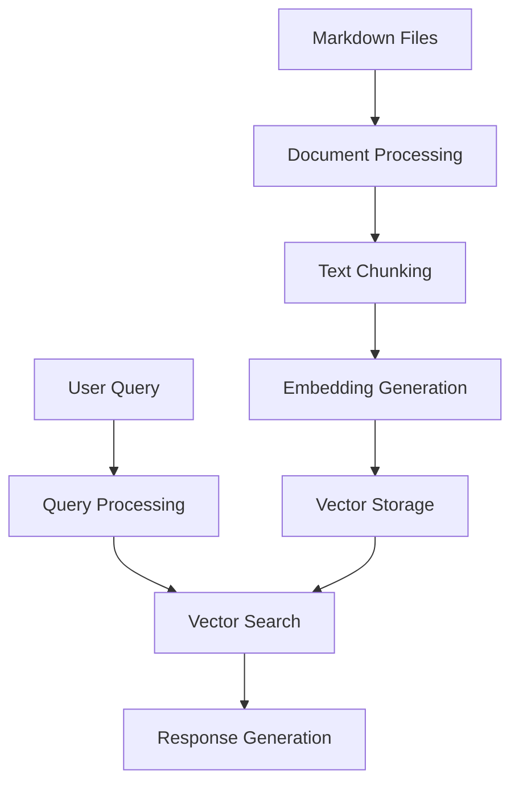

# Technical Documentation

This document provides a detailed technical explanation of how the Obsidian Vault Query Tool works, its architecture, and the concepts behind it.

## Architecture Overview

The tool is built using several key components, all implemented in `obsidian.py`:

1. **Document Processing Pipeline** (`obsidian.py:1-250`)
2. **Embedding Generation** (`obsidian.py:251-300`)
3. **Vector Storage** (`obsidian.py:301-350`)
4. **Query Processing** (`obsidian.py:351-400`)
5. **Response Generation** (`obsidian.py:401-450`)

Here's how these components work together:



## Component Details

### 1. Document Processing Pipeline

#### 1.1 File Loading (`obsidian.py:load_markdown_files`)
```python
def load_markdown_files(vault_path: str) -> List[Tuple[str, Dict[str, Any], str]]:
    """Load all Markdown files from the given vault path with Obsidian-specific processing."""
```
- Recursively scans the Obsidian vault for `.md` files
- Handles file encoding and error cases
- Preserves file structure and relationships

#### 1.2 Obsidian Feature Processing
The tool processes several Obsidian-specific features in separate functions:

##### Frontmatter Parsing (`obsidian.py:parse_frontmatter`)
```python
def parse_frontmatter(content: str) -> Tuple[Dict[str, Any], str]:
    """Parse Obsidian's YAML frontmatter if present."""
```
- Uses regex to identify YAML frontmatter
- Parses using PyYAML library
- Stores as metadata for each document

##### Tag Extraction (`obsidian.py:extract_tags`)
```python
def extract_tags(content: str) -> List[str]:
    """Extract Obsidian tags from content."""
```
- Uses regex `#(\w+)` to find tags
- Stores as metadata for filtering and organization

##### Internal Link Processing (`obsidian.py:process_obsidian_links`)
```python
def process_obsidian_links(content: str, vault_path: str) -> str:
    """Process Obsidian's internal links and convert them to readable text."""
```
- Converts to readable text
- Preserves display text when available
- Maintains document relationships

##### Callout Processing (`obsidian.py:process_callouts`)
```python
def process_callouts(content: str) -> str:
    """Process Obsidian's callouts (admonitions) to make them more readable."""
```
- Converts to readable format
- Preserves callout type and content

### 2. Text Chunking

The tool uses LangChain's `RecursiveCharacterTextSplitter` in `index_vault()`:
```python
text_splitter = RecursiveCharacterTextSplitter(
    chunk_size=500,      # Number of characters per chunk
    chunk_overlap=50     # Number of characters to overlap between chunks
)
```

Benefits:
- Maintains context across chunk boundaries
- Optimizes for embedding model input size
- Preserves document structure

### 3. Embedding Generation

Uses Ollama's `nomic-embed-text` model in both indexing and querying:
```python
embedding_model = OllamaEmbeddings(model="nomic-embed-text")
```

Key features:
- Local processing (no API calls)
- High-quality embeddings
- Fast processing

### 4. Vector Storage

Uses ChromaDB for vector storage and retrieval in `index_vault()`:
```python
vector_store = Chroma.from_documents(
    documents,
    embedding=embedding_model,
    persist_directory=CHROMA_DB_PATH
)
```

Features:
- Persistent storage
- Efficient similarity search
- Metadata filtering

### 5. Query Processing

#### 5.1 Query Flow (`obsidian.py:query_vault`)
```python
def query_vault(question: str, filter_tags: List[str] = None) -> None:
    """Query the indexed data with a question and optional tag filtering."""
```
1. User submits query
2. Query is embedded using same model
3. Similarity search performed
4. Relevant documents retrieved
5. Response generated

#### 5.2 Tag Filtering
```python
if filter_tags:
    search_kwargs["filter"] = {"tags": {"$in": filter_tags}}
```
- Filters results by specified tags
- Uses ChromaDB's metadata filtering
- Supports multiple tags

#### 5.3 Similarity Search
```python
retriever = vector_store.as_retriever(
    search_type="similarity_score_threshold",
    search_kwargs={
        "k": 4,                    # Number of results
        "score_threshold": 0.5     # Minimum similarity score
    }
)
```
- Returns top 4 most relevant chunks
- Filters by similarity threshold
- Balances relevance and coverage

### 6. Response Generation

Uses Ollama's Mistral model with a custom prompt defined at the top of the file:
```python
CUSTOM_PROMPT = """You are a helpful assistant that answers questions based on the provided context from an Obsidian vault.
The context comes from various notes, and each piece of information includes metadata about its source.

Context information:
{context}

Question: {question}

Please provide a detailed answer based on the context. If the information comes from specific notes, mention them by name.
If you're not sure about something, say so. Don't make up information that isn't in the context.

Answer:"""
```

Features:
- Context-aware responses
- Source attribution
- Confidence indication

## Technical Considerations

### 1. Performance

#### Memory Usage
- Chunk size (500 chars) balances:
  - Context preservation
  - Memory efficiency
  - Processing speed

#### Storage
- ChromaDB provides efficient vector storage
- Embeddings are persisted for reuse
- Metadata enables fast filtering

### 2. Scalability

The tool can handle:
- Large vaults (thousands of files)
- Deep directory structures
- Various file sizes

Limitations:
- Memory constraints for very large files
- Processing time for initial indexing
- Storage requirements for embeddings

### 3. Security

Features:
- Local processing only
- No external API calls
- No data transmission

### 4. Extensibility

The architecture supports:
- Adding new Obsidian features
- Different embedding models
- Alternative vector stores
- Custom response formats

## Future Improvements

1. **Performance**
   - Batch processing for large vaults
   - Incremental updates
   - Caching mechanisms

2. **Features**
   - More Obsidian features (tables, code blocks)
   - Advanced filtering options
   - Query history and favorites

3. **User Experience**
   - Interactive query interface
   - Result visualization
   - Query suggestions

4. **Integration**
   - Obsidian plugin
   - API interface
   - Web interface

## License

This project is licensed under the MIT License - see the [LICENSE](LICENSE) file for details.